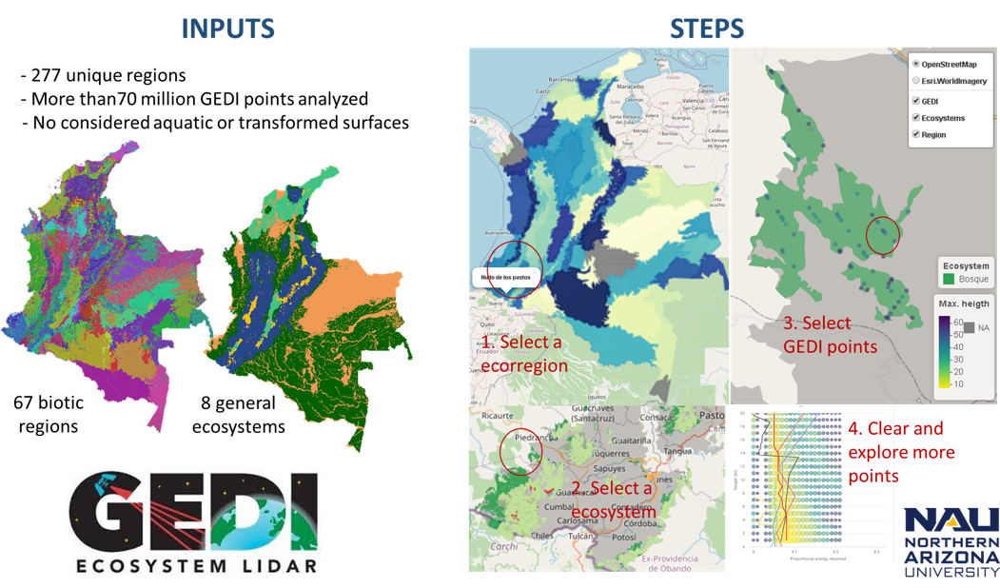

#### *OVERVIEW*

This tool allow users to explore GEDI measurements across Colombian regions and ecosystems. The project is led by Dr. Patrick Jantz and developed by Ph.D. student Ivan Gonzalez

#### *USE*

Jump into *Profile tool L2a*, *Profile tool L2b*, *Compare*, *Similarity tool* or *Heigth map* tabs to start exploring the points. 

#### *DATA*

* Biotic regions: Vectorial layer from Environmental Studies Intitute in Colombia (Instituto de Hidrología, Meteorología y Estudios Ambientales - IDEAM). Available [here](http://www.siac.gov.co/catalogo-de-mapas)(1.7GB).
* Ecosystems: Vectorial layer from Environmental Studies Intitute in Colombia (Instituto de Hidrología, Meteorología y Estudios Ambientales - IDEAM). Available [here](http://www.siac.gov.co/catalogo-de-mapas)(40MB).
* GEDI points: HDF5 files from NASA level 2 prdocuts repositories. Check more [here](https://lpdaac.usgs.gov/products/gedi02_av001/).

#### *CONTACT*

Please sent an email to Ivan.Gonzalez@nau.edu with some screenshots in the case you have problems or suggestions!

### Check more from our work at **[GEODE Goetz lab](https://goetzlab.rc.nau.edu/)**